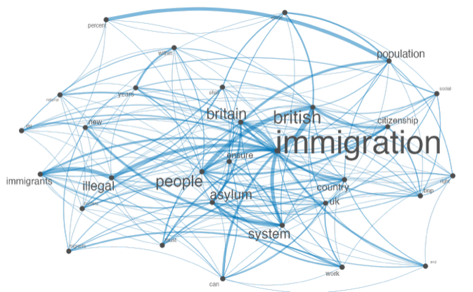

```{r setup, include=FALSE}
library(learnr)
library(gradethis)
library(quanteda)
library(magrittr)
library(ggplot2)
library(quanteda.textplots)

tutorial_options(exercise.timelimit = 60)
knitr::opts_chunk$set(echo = FALSE)

# set CRAN repo for install.packages 
r = getOption("repos")
r["CRAN"] = "http://cran.us.r-project.org"
options(repos = r)
```

<html>
<head>
<style>
h1 {text-align: center;}
h2 {text-align: center;}
</style>
</head>
<body>

<h1 style="color:#203FCD"> Textual Analysis in R: Quanteda 101 </h1>
</body>
</html>

## _

<p style="text-align:center;"></p>


## Welcome to Quanteda Tutorial 1
<center> <h1 style="font-size:20px"> Learning goals: this tutorial will teach you to </h1> </center>


<ol style="font-family: Verdana; color:#203FCD; font-size:18px; list-style-position: inside; font-size:14px">
  <li>Create a text corpus</li>
  <li>Create a data frame matrix</li>
  <li>Specify meta data</li>
    <ul style="list-style-position: inside">
      <li>Docvars</li>
      <li>Docnames</li>
    </ul>
  <li>Process your textual data</li>
    <ul style="list-style-position: inside">
      <li>tokenisation</li>
      <li>stemming</li>
      <li>lemmatisation</li>
      <li>stopwords</li>
    </ul>
  <li>Plot textual data</li>
  <li>Analyse word frequencies</li>
</ol>


## Introduction to **quanteda**
### What is quanteda?
**quanteda** is an R package for managing and analyzing textual data developed by Kenneth Benoit, Kohei Watanabe, and other contributors.
It is part of the [Quanteda Initiative](http://quanteda.org), a non-profit company aimed at advancing development and dissemination of open-source tools for text analytics.

Text analysis with quanteda goes through all those three types of objects either explicitly or implicitly.

<ol style="font-family: Helvetica; color:#203FCD; list-style-position: inside">
  <li>Corpus</li>
  <li>Tokens</li>
  <li>Document-feature matrix (dfm)</li>
</ol>

### Typical workflow 

<p style="text-align:center;"></p>

### Installing and loading **quanteda**

In this tutorial we have already installed the **quanteda** package for you. When using **quanteda** from your own computer you can install the **quanteda** package from [CRAN](https://cran.r-project.org/package=quanteda) with: `install.packages("quanteda")`. 

After installation we load the **quanteda** package:
**Remember to reload the packages each time you open this tutorial**
```{r load_packages, exercise=TRUE, exercise.lines = 5}
library("quanteda")
packageVersion("quanteda")
```

### Additional resources
- Documentation: 
    - <https://quanteda.io>
    - <https://readtext.quanteda.io>
    - <https://spacyr.quanteda.org>

- Tutorials: <https://tutorials.quanteda.io>

- Cheatsheet: <https://www.rstudio.com/resources/cheatsheets/>

## 1. Creating a text corpus
### What is a text corpus?
A text corpus saves character strings and variables in a data frame, and combines texts with document-level variables.

You can create a corpus from various available sources:
<ol style="font-family: Helvetica; list-style-position: inside">
  <li>**A character vector** </li>
  <ul>
      <li>Consists of one document per element; if the elements are named, these names will be used as document names.</li>
    </ul>
  <li>**A data.frame (or a tibble tbl_df)**</li>
  <ul>
      <li> The default document id is a variable identified by docid_field; the text of the document is a variable identified by text_field; and other variables are imported as document-level meta-data. This matches the format of data.frames constructed by the the readtext package.</li>
    </ul>
  <li>**A kwic object constructed by kwic()**</li>
  <li>**A tm VCorpus or SimpleCorpus class object**</li>
    <ul>
      <li>Fixed metadata fields imported as docvars and corpus-level metadata imported as meta information.</li>
    </ul>
  <li>**A corpus object**</li>
</ol>

### What are the functions?
The main function for creating a corpus is `corpus()`. 

#### Tip:
Remember you can use `?` before the name of any function to access it's documentation
_Have a go here:_
```{r text_corpus1, exercise=TRUE, warning=FALSE}
?corpus
```


### Example code
```{r text_corpus, exercise=TRUE, warning=FALSE}
library(quanteda)
# create text corpus
corp <- corpus(c("A corpus is a set of documents.",
                 "This is the second document in the corpus."))
# print text corpus                 
corp
```
### Practice
_Create your own corpus using three sentences, print it out to have a look, and get a summary using `summary(your_corp)`._
```{r text_corpus_ex, exercise=TRUE, warning=FALSE, exercise.lines = 6}
# create text corpus
your_corp <- 

```
### Extra corpus functions: docnames, docvars and meta.
<p style="font-family: Verdana; color:#203FCD; font-size:13px">**docnames:** A unique name assigned to each text in the corpus (in the case of our corpus above, each sentence would be one text). These can be assigned manually, obtained from existing text metadata (for eg. names of documents), or will otherwise be assigned as "text1", "text2", etc. automatically. </p>
<ul style="font-family: Verdana; list-style-position: inside; font-size:12px">
    <li> Assigned manually using: `docnames(x) <- value`, where _x_ = corpus to which docnames are to be assigned,   and <br> _value_ = a character vector of labels equal in length to the number of texts. 
    </li>
  </ul>
<p style="font-family: Verdana; color:#203FCD; font-size:13px">**docvars:** A data.frame of document-level variables associated with each text. For example, dates, locations, authors.</p>
<ul style="font-family: Verdana; list-style-position: inside; font-size:12px">
    <li> Assigned manually using: `docvars(x, field = NULL) <- value`, where _x_ = corpus to which docnames are to be assigned, <br> _value_ = a vector of document variable values and _field_ = a string containing the document-level variable name (eg. "Location", "Date" etc)
    </li>
      </ul>
<p style="font-family: Verdana; color:#203FCD; font-size:13px">**meta:** a named list that will be added to the corpus as corpus-level, user meta-data. This can later be accessed or updated using meta().</p>
<ul style="font-family: Verdana; list-style-position: inside; font-size:12px">
    <li> See [`meta()`](https://quanteda.io/reference/meta.html) or for more information.
    </li>
</ul>

#### Working with corpus meta-data
To read the meta-data of a corpus, use `meta()` and input your corpus name <br>
_Exercise: try it yourself using in-built quanteda corpus `data_corpus_inaugural`_
```{r meta, exercise=TRUE, exercise.lines=3}

```

```{r meta-solution, exercise=FALSE, exercise.lines=3, exercise.reveal_solution = TRUE}
meta(data_corpus_inaugural)
```

#### How about if you want to assign meta-data to your corpus?
To assign meta-data, you also use `meta()` <br>
_For example:_
```{r meta2, exercise=TRUE}
meta(data_corpus_inaugural, "newfield") <- "This is a new field of metadata."
# now rerun `meta()` to see your new metadata field.
meta(data_corpus_inaugural)

```

## 2. Tokenisation

### What is tokenisation?
Tokens are a sequence of characters that are grouped together as a useful semantic unit.<br>
<ul style="list-style-position: inside; font-size:14px">
  <li>Words, punctuation, numbers, symbols </li>
  <li>Usually, but not always, delimited by spaces</li>
  <li>More efficient than character strings, but preserves positions of words</li>
</ul>

### Tokenization steps

1. **Lowercase**
    - "a corpus is a set of documents."
    - "This is a thrillingly constructed example."

2. **Remove stopwords and punctuation**
    - "corpus set documents"
    - "thrillingly constructed example"
  
3. **Stem**
    - "corpus set document"
    - "thrill construct exampl"
    
4. **Tokenize**
    - corpus, set, document
    - thrill, construct, exampl

### What are the functions?
The main function for creating a corpus is `tokens()`. 

### Example code
```{r toks_ex, exercise=TRUE}
toks <- tokens(c("A corpus is a set of documents.",
                  "This is a thrillingly constructed example."))
toks
```

### Word stemming and stopwords
**Word stems** are the part of the word that carry it's lexical meaning, and usually do not appear on their own. In linguistic terms, it is the part of a word that appears before inflectional affixes are added. For example, the word stem of the word "migration" is "migra". This alone isn't a word, but it is the root of many words such as "migratory", "migrant", "migrants". <br>
Once you have a tokens object, you can look at the word stems of your tokens using `tokens_wordstem()`, and reassign your tokens object to include only stems.
```{r toks_ex1, exercise=TRUE}
toks <- tokens(c("A corpus is a set of documents.",
                   "This is a thrillingly constructed example."))
toks_stem <- tokens_wordstem(toks)
head(toks)
head(toks_stem)
```

**Stop words** are function words (grammatical words) that have little or no substantive meaning in pre-processing. `stopwords()` returns a pre-defined list of function words used in quanteda.
```{r toks_ex2, exercise=TRUE}
stopwords()
```

We usually remove stopwords before analysis. You can remove stopwords from your tokens object using `tokens_remove()`, as you can see below.
```{r toks_ex3, exercise=TRUE}
# example
toks <- tokens(c("A corpus is a set of documents.",
                  "This is a thrillingly constructed example."))
toks_nostop <- tokens_remove(toks, pattern = stopwords("en"))
head(toks)
head(toks_nostop)
```

### Practice
1. Create a new corpus, consisting of two texts<br>
  _a) "This is my first text."_ <br> 
  _b) "This is not my first text, this is my second text."_ <br>
2. Tokenise it using`tokens(corp)`.<br>
3. Remove punctuation using 'remove_punct = FALSE'<br>
4. Remove stopwords using `tokens_remove()` <br>
5. Have a look at your tokens using `head()`<br>

```{r toks_exx, exercise=TRUE}
corp <- 
toks <- tokens(corp, ...)
```
_Hint: you can use summary(toks) to see the integer value for number of tokens in each text_
```{r toks_qu1, echo=FALSE}
question("How many tokens in each text?",
  answer("5, 5"),
  answer("5, 11"),
  answer("6, 12"),
  answer("6, 13", correct = TRUE),
  incorrect = "Incorrect. Did you pay close attention to words and punctuation?")
```

```{r toks_qu2, echo=FALSE}
question("How many tokens in each text if you specify remove_punct = TRUE?",
  answer("5, 5"),
  answer("5, 11", correct = TRUE),
  answer("6, 12"),
  answer("6, 13"),
  incorrect = "Incorrect. There should be 5 tokens in the first text, and 11 in the second. The number of tokens goes down, because punctuation tokens are removed.")
```

```{r toks_qu3, echo=FALSE}
question("How many tokens in each text once you remove stopwords and punctuation?",
  answer("3, 5"),
  answer("4, 4"),
  answer("3, 3", correct = TRUE),
  answer("6, 13"),
  incorrect = "Incorrect. There should be 3 tokens in the first text, and 3 in the second. The number of tokens goes down, because stopwords and punctuation tokens are removed.")
```

### Extra corpus functions
Some extra parameters when tokenising your corpus include
<ul style="list-style-position: inside; font-size:14px">
  <li>remove_punct </li>
  <li>remove_symbols </li>
  <li>remove_numbers </li>
  <li>remove_url </li>
  <li>remove_separators </li>
</ul>

## 3. Creating a DFM
### What is a DFM?
A DFM is a matrix of documents (rows) by "features" (columns), representing frequencies of features by document.
<ul style="list-style-position: inside; font-size:14px">
  <li> **Features** are (selected) types, possibly transformed (such as through stemming). But could also be dictionary categories.
 </li>
  <li>DFMs are **sparse**, in that only non-zero cells are recorded
 </li>
  <li>The most efficient structure, but it does not have information on positions of words
 </li>
  <li>Non-positional (bag-of-words) analysis are performed using many of the textstat_* and textmodel_* functions
 </li>
</ul>

### What does a document-feature matrix look like?
<ul style="list-style-position: inside; font-size:14px">
  <li> Token frequencies are listed per document
</ul>
Document 1: "_A corpus is a set of documents._"  
Document 2: "_This is the second document in the corpus._"


|            | corpus| set     | document  | second  |
|------------|-------|---------|--------   | ------- |
| Document 1 | 1     | 1       | 1         | 0       |    
| Document 2 | 1     | 0       | 1         | 1       |    
| ...        |       |         |           |         |
| Document *n* | 0   | 1       | 1         | 0       |

### What are the functions?
The main function for creating a corpus is `dfm()`. 

### Example code
Below we use `data_char_ukimmig2010`, a sample dataset from the **quanteda.textmodels** package.
```{r dfm_ex, exercise=TRUE}
# set up your corpus and tokenise it
corp_immig <- corpus(data_char_ukimmig2010)
toks_immig <- tokens(corp_immig)

# create your dfm 
dfm_immig <- dfm(toks_immig) 
dfm_immig
```
You can get some extra descriptive info about your dfm using `summary(dfm_immig)`, `docnames(dfm_immig)`, `docvars(dfm_immig)` and check for any metadata using `meta(dfm_immig)`<br>
_Have a go above!_
```{r dfm_qu1, echo=FALSE}
question("What is the length of dfm_immig?",
  answer("1494"),
  answer("0"),
  answer("14940", correct = TRUE),
  answer("15940"),
  incorrect = "Incorrect. Find the length of the dfm by running `summary(dfm_immig)`")
```

```{r dfm_qu2, echo=FALSE}
question("Which one of the following is **not** a docname in dfm_immig?",
  answer("BNP"),
  answer("LibDem"),
  answer("Greens"),
  answer("Conservative"),
  answer("PC"),
  answer("TUC", correct = TRUE),
  answer("Coalition"),
  answer("SNP"),
  answer("Labour"),
  answer("UKIP"),
  incorrect = "Incorrect. Find the docnames of the dfm by running `docnames(dfm_immig)`")
```

### Quick recap of **magrittr**'s pipe operator in R
The pipe operator in R `%>%` takes the output of the statement before it and uses it as the input of the statement after it. 

For example, the following expressions result in the same output
```{r pipping, exercise=TRUE}
data_corpus_inaugural %>% 
    tokens() 

tokens(data_corpus_inaugural)
```

_Exercise: Try it yourself - rewrite the following code using pipe operators:_
```{r pipping2, exercise=TRUE}
dfm(tokens(corpus(c("my corpus text."))))

```

```{r pipping_ex, exercise=TRUE, exercise.lines = 6}

```

```{r pipping_ex-hint}
"my corpus text." %>%
   c() %>%
  
  
```

```{r pipping_ex-solution, exercise.reveal_solution = FALSE}
"my corpus text." %>%
   c() %>%
  corpus() %>%
  tokens() %>%
  dfm()
```
 
```{r pipping_ex-code-check}
grade_code()
```

### Practice
<ul style="list-style-position: inside; font-size:14px">
  <li> `data_corpus_inaugural` is a built-in quanteda dataset with the following docvars:</li>
  <ol>
    <li> **Year** - a four-digit integer year</li>
    <li> **President character** - President's last name</li>
    <li> **FirstName character** - President's first name (and possibly middle initial)
</li>
    <li> **Party factor** - name of the President's political party
</li>
  </ol>
</ul>
_Source_ <br>
https://archive.org/details/Inaugural-Address-Corpus-1789-2009 <br> https://www.presidency.ucsb.edu/documents/presidential-documents-archive-guidebook/inaugural-addresses.

_Exercise: Create a document-feature matrix using the data_corpus_inaugural dataset using `magittr`'s pipping operators <br> (See the hint and solution if you get stuck!)._
```{r create_dfm_ex, exercise=TRUE, exercise.lines = 6}

```

```{r create_dfm_ex-hint, exercise=FALSE}
my_dfm <- tokens(...) %>%
  ...(stopwords("en")) %>%
  ...(language = "en") %>%
  dfm()
```

```{r create_dfm_ex-solution, exercise=FALSE, exercise.reveal_solution = TRUE}
my_dfm <- tokens(data_corpus_inaugural, remove_punct = TRUE) %>%
  tokens_remove(stopwords("en")) %>%
  tokens_wordstem(language = "en") %>%
  dfm()

summary(my_dfm)
docvars(my_dfm)
```

```{r create_dfm_ex-code-check}
grade_code()
```
_Have a look at my_dfm using the `summary()` function._
```{r dfm_prac1, echo=FALSE}
question("What is the length of dfm_immig?",
  answer("325503", correct = TRUE),
  answer("32550"),
  answer("32553"),
  answer("1"),
  incorrect = "Incorrect. Find the length of the dfm by running `summary(dfm_immig)`")
```
_Use the right function to answer the following question (see Example section above for a reminder)_
```{r dfm_prac2, echo=FALSE}
question("Which year was John Adams' innaugural speech, and which party was he representing?",
  answer("Repulican, 1800"),
  answer("Whig, 1789"),
  answer("Democrat, 1910"),
  answer("Whig, 1809"),
  answer("Federalist, 1805"),
  answer("Republican, 1880"),
  answer("Democrat, 1900"),
  answer("Whig, 1880"),
  answer("Federalist, 1797", correct = TRUE),
  answer("Democratic-Republican, 1910"),
  answer("Whig, 1805"),
  incorrect = "Incorrect. Find the docnames of the dfm by running `docvars(dfm_immig)`")
```

## Analysing DFMs basics 
### Feature counts
Start by loading the **quanteda.textstats** package.
```{r vis0, exercise=TRUE}
library("quanteda.textstats")
packageVersion("quanteda.textstats")
```
Once you have constructed your dfm, adjusted stopwords, stemming and punctuation features and specified the meta-data you need using docnames, meta and docvars, you are now ready to perform some descriptive analysis on the dataset. One first step is to summarise the top features in your dfm. You can simply summarise the column counts in your dfm using `colSums()`, which counts the features, sorts them (decreasing or otherwise) and prints them. You can use `head()`, as below, to print on the top 6 features. <br>
Alternatively, **quanteda** also has a built-in features frequency function `textstat_frequency()`, which allows you to specify the number of features using `n = x`. Try out the two options below.
```{r vis, exercise=TRUE}
# create your dfm object from data_corpus_inaugural
my_dfm <- tokens(data_corpus_inaugural, remove_punct = TRUE) %>%
  tokens_remove(stopwords("en")) %>%
  tokens_wordstem(language = "en") %>%
  dfm()

# using colSums
colSums(dfm) %>%
    sort(decreasing = TRUE) %>%
    head(n = 6)
# using quanteda textstat_frequency
textstat_frequency(my_dfm, n = 6)
```
Now you have a sense of what the main recurring features are in the dfm, you might want to have a look at how these features are distributed accross the different Presidents' speeches.

### Texplots
Start by loading the **quanteda.textplots** and **ggplot2** packages <br> 
(make sure you have **ggplot2** installed already using `install.packages()`)
```{r vis2, exercise=TRUE}
library("quanteda.textplots")
library("ggplot2")
packageVersion("quanteda.textplots")
packageVersion("ggplot2")
```

#### Frequency plots
Now you have a sense of what the main recurring features are in the dfm, you can visualise these in a texplot.<br>
**Note: this is a [ggplot](https://ggplot2.tidyverse.org/index.html) object, which means you can modify the plot features using ggplot functions.**
```{r vis3, exercise=TRUE}
# create your dfm object from data_corpus_inaugural
my_dfm <- tokens(data_corpus_inaugural, remove_punct = TRUE) %>%
  tokens_remove(stopwords("en")) %>%
  tokens_wordstem(language = "en") %>%
  dfm()

features_dfm_inaug <- textstat_frequency(my_dfm, n = 70)

# Sort by reverse frequency order
features_dfm_inaug$feature <- with(features_dfm_inaug, reorder(feature, -frequency))

ggplot(features_dfm_inaug, aes(x = feature, y = frequency)) +
    geom_point() + 
    theme(axis.text.x = element_text(angle = 90, hjust = 1))
```

#### Wordclouds
A second method you can use to visualise your dfm is wordclouds, which allow you to plot the top features.
```{r vis4, exercise=TRUE}
# create your dfm object from data_corpus_inaugural
my_dfm <- tokens(data_corpus_inaugural, remove_punct = TRUE) %>%
  tokens_remove(stopwords("en")) %>%
  tokens_wordstem(language = "en") %>%
  dfm()

set.seed(100)
textplot_wordcloud(my_dfm)
```

#### Lexical dispersion plots: plotting methods for corpus and tokens objects
Often, it is not only the frequency of words that we are interested in, but also where they appear in the text. In the case of innaugural speeches, the topics that a President chooses to begin and end their speech on can say a lot. You can plot this using a lexcial dispersion plot, which allows us to visualize the occurrences of particular terms throughout the text.<br>
**To do this, you will need to start by creating a `kwic()` object from your dfm**<br>
`kwic()` returns the _keywords in context_, which allows us to see how keywords are used in the actual contexts in a concordance view produced by kwic(). Have a look at the keyword 'immigration' in context below.<br>
_Note: `kwic()` takes a character, corpus or tokens object as it's argument._
```{r visa, exercise=TRUE}
# create your tokens object from data_corpus_inaugural
toks <- tokens(data_corpus_inaugural, remove_punct = TRUE) %>%
  tokens_remove(stopwords("en")) %>%
  tokens_wordstem(language = "en")

kw_immig <- kwic(toks, pattern =  "immig*")
head(kw_immig, 10)
```

Now you have had a look at some keywords in context, you can plot them on a lexcial dispersion plot. In this case, we first subset the corpus so that we see the keywords in context for inaugural Presidential speeches from 1949 onwards only.<br>

##### Practice

_Exercise: <br> 1. Fill in the "..." space to choose a keyword you are interested in, remember you can use **stem words** followed by an asterisk (this will include all words derived form that stem) <br> 2. Add another kwic() object, and specify another word of your choice._
```{r visb, exercise=TRUE}
# create your tokens object from data_corpus_inaugural
data_corpus_inaugural_subset <- 
    corpus_subset(data_corpus_inaugural, Year > 1949)

textplot_xray(
     kwic(tokens(data_corpus_inaugural_subset), pattern = "God"),
     kwic(tokens(data_corpus_inaugural_subset), pattern = "...")
)
```
Notice anything interesting about the lexical dispersion of the word 'God'...?
```{r visprac, echo=FALSE}
question("Where in the inaugural speeches does the word 'God' consistently appear?",
  answer("the start"),
  answer("the end", correct = TRUE),
  answer("nowhere"),
  answer("everywhere"),
  incorrect = "Incorrect. Have a closer look. Notice that Presidents Eisenhow (in 1957), Kennedy, Johnson and Carter are the notable exceptions.")
```
_What does this tell you about the context in which Presidents from 1949 until today mention God in their inaugural speeches?_

## Project: Plotting textual data
Now you have a feel of how to do some text analysis, have a go at doing it yourself on your own computer! Follow the instructions below using RStudio on your own computer.

### German Chancellor Speeches: about the dataset
Your task will be use German Chancellor Speeches to see how many times different words appear in speeches made by German Chancellors Gerhard Schröder and Angela Merkel, using a texplot.
<ul style="list-style-position: inside; font-size:14px; ; color:#203FCD">
    <li> Access and read the dataset in as a .txt file from a folder on your computer </li>
    <li> Create better docnames for the dataset by pasting "Year" and "Chancellor"</li>
    <li> Select speeches by Gerhard Schröder and Angela Merkel.</li>
    <li> Check ?textplot_xray().</li>
    <li> Choose words that might only appear in some of the speeches.</li>
</ul>

### Project
#### 1. Write the code to read in .txt files from a folder on your computer
<ul style="list-style-position: inside; font-size:14px">
    <li> _**a**. Set up a RProj in a new folder._ 
    <ul>
  <li>See ['Using RStudio Projects'](https://support.rstudio.com/hc/en-us/articles/200526207-Using-RStudio-Projects) for help on how to set these up and learn about when they are used._ <br></li>
  </ul> 
 </li>
    <li> _**b**. Download [ZIP file](https://tinyurl.com/corp-regierung) with inaugural speeches by German chancellors_<br>
</li>
    <li> _**c**. Copy the folder into your RProj folder._<br>
</li>
<li> _**d**. Open up an R script (File -> New File -> R Script) to work in._ </li>
  <ul>
  <li>Make sure to install and load **quanteda** and the other packages you will be using such as **readtext**, as you have done in your exercises above, using `install.packages()` and `library("quanteda")`</li>
  </ul>
    <li> _**e**. Import all text files using `readtext()`._ 
    <ul>
  <li>See [here](https://cran.r-project.org/web/packages/readtext/vignettes/readtext_vignette.html) for some instruction on how to use the readtext package.</li>
  </ul> 
</li>
    <li> _**f**. Create a text corpus of this data frame._<br>
</li>
</ul>

#### 2. Create better docnames by pasting *"Year"* and *"Chancellor"*, and seperating with "_". <br>

<ul style="list-style-position: inside; font-size:14px">
    <li> _**Hint:** You can access particular features from your dfm's docvars by specifying their name in `docvars()`, for example `docvars(data_corpus_inaugural_ger, "Year")`._ <br>
    <ul>
  <li>[Paste]("https://www.rdocumentation.org/packages/base/versions/3.6.2/topics/paste") _allows you to reassign new docnames to `docnames(data_corpus_inaugural_ger)` by concatenating vectors `docvars(data_corpus_inaugural_ger, "Year")` and `docvars(data_corpus_inaugural_ger, "Chancellor")`, and specifying a seperator using the `sep=""` argument._ </li>
  </ul> 
 </li>
</ul>

#### 3. Select speeches by Gerhard Schröder and Angela Merkel.<br>
<ul style="list-style-position: inside; font-size:14px">
    <li> _**Hint:** You can do this using `corpus_subset()`. Have a look back at how we used it earlier when creating our lexical dispersion plot for inaugural speeches from 1949 onwards. For more help, remember `?corpus_subset` will show you the documentation for this function._
 </li>
</ul>

#### 4. Load the quanteda.textplots package. <br>
<ul style="list-style-position: inside; font-size:14px">
    <li> _**Hint:** Check ?textplot_xray()._ </li>
</ul>

#### 5. Produce a textplot xray using words that might only appear in some of the speeches, similarly to above.<br>
<ul style="list-style-position: inside; font-size:14px">
    <li> _**Optional:** Start with the stem words "Arbeits\*", "Arbeitslos\*", "Migration"_
 </li>
</ul>

#### 6. Now have a look at your textplot!

```{r project, exercise=TRUE, exercise.lines = 1}
# Click hint above to get some help (click on to see the solution if you get really stuck)
```

```{r project-hint}
# Replace '...' with correct input
docnames(...) <- paste(
    docvars(..., "..."),
    docvars(..., "..."),
    sep = ", ")

# Replace '...' with correct input
toks_schroeder_merkel <- ... %>% 
    corpus_subset(... %in% c("...", "...")) %>%
    tokens()

# Load the quanteda.textplots library

# Produce textplot
plot_xray <- textplot_xray(
    kwic(..., "...*"),
    kwic(..., "...*"),
    kwic(..., "...*"))

# Now have a look at your textplot
```

```{r project-solution, exercise=FALSE, exercise.reveal_solution = TRUE}
# Edit docnames
docnames(data_corpus_inaugural_ger) <- paste(
    docvars(data_corpus_inaugural_ger, "Year"),
    docvars(data_corpus_inaugural_ger, "Chancellor"),
    sep = ", ")

# Select speeches
toks_schroeder_merkel <- data_corpus_inaugural_ger %>% 
    corpus_subset(Chancellor %in% c("Merkel", "Schroeder")) %>%
    tokens()

# Load the quanteda.textplots library
library("quanteda.textplots")

# Produce textplot
plot_xray <- textplot_xray(
    kwic(toks_schroeder_merkel, "Arbeits*"),
    kwic(toks_schroeder_merkel, "Arbeitslos*"),
    kwic(toks_schroeder_merkel, "Migration*")
)

# Now have a look at your textplot
plot_xray

```


```{r project-code-check}
grade_code()

```

#### For more on analysis, see the Quanteda 102 tutorial.

## Congratulations! You've completed Tutorial 1: Quanteda!
<p style="text-align:center;"></p>

### Let us know what you thought about the tutorial, we'd love to hear your thoughts!
* Text box that automatically deposits responses in certain location?


