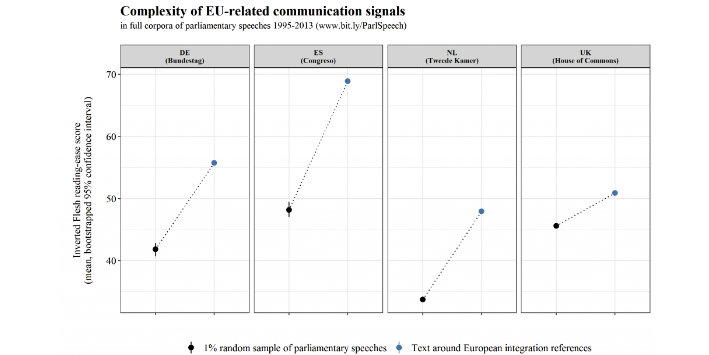

```{r setup, include=FALSE}
library("learnr")
library("gradethis")
library("quanteda")
library("magrittr")
library("ggplot2")
library("quanteda.textplots")
library("quanteda.textmodels")
library("quanteda.textstats")
library("quanteda.corpora")

knitr::opts_chunk$set(echo = FALSE)
tutorial_options(exercise.checker = gradethis::grade_learnr)
tutorial_options(exercise.timelimit = 60)
knitr::opts_chunk$set(echo = FALSE)

# set CRAN repo for install.packages 
r = getOption("repos")
r["CRAN"] = "http://cran.us.r-project.org"
options(repos = r)
```

## Welcome to Quanteda Tutorial part 2


This tutorial will cover **Frequency and Sentiments Analysis** in **Quanteda**. The learning goals of this tutorial are

-   Review tokens and dfm objects
-   Keyword analysis
-   Frequency analysis
-   Lexical diversity analysis
-   Measuring readability
-   Sentiment analysis (using dictionaries)
-   Preview of other methods

```{r, eval = TRUE, message = FALSE, echo = FALSE, warning=FALSE}
library("quanteda")
```

## 1. Review of the data frame matrix (dfm)

A DFM is a matrix of documents (rows) by "features" (columns), representing frequencies of features by document.

-   **Features** are (selected) types, possibly transformed (such as through stemming). But could also be dictionary categories.
-   DFMs are **sparse**, in that only non-zero cells are recorded
-   The most efficient structure, but it does not have information on positions of words
-   Non-positional (bag-of-words) analysis are performed using many of the textstat\_\* and textmodel\_\* functions

### *dfm review exercise*

Below we use the `data_char_ukimmig2010` data, a sample dataset from the **quanteda.textmodels** package. We have created a corpus and tokenised the data for you.

1.  Create a document-feature matrix from the `toks_immig` object, and call it `dfm_immig`.
2.  Get the 50 most frequent terms from `dfm_immig` using `topfeatures()`.
3.  That doesn't look right, we need to remove punctuation and stopwords! First let's remove the punctuation. Run your code again to test the punctuation has been removed.
4.  Now remove the stopwords. Run your code again to test the outcome.
5.  Finally, it is often useful to remove a word to its stem (e.g. taxing and taxes both get stemmed to tax). Use `tokens_wordstem()` to stem your tokens. Run your code again and review how the output has changed.

```{r dfmrev, exercise=TRUE, exercise.lines=10}
library("quanteda")
library("quanteda.textmodels")
corp_immig <- corpus(data_char_ukimmig2010)
toks_immig <- tokens(corp_immig)
dfm_immig <- 
```

```{r dfmrev-solution}
library("quanteda")
library("quanteda.textmodels")
corp_immig <- corpus(data_char_ukimmig2010)
toks_immig <- tokens(corp_immig, remove_punct = TRUE) %>%
  tokens_remove(stopwords("en")) %>%
  tokens_wordstem(language = "en")

dfm_immig <- dfm(toks_immig)
topfeatures(dfm_immig, n = 50)
```

```{r dfmrev-hint-1}
dfm_immig <- dfm(toks_immig)
topfeatures(dfm_immig, n = ...)
```

```{r dfmrev-hint-2}
tokens(corpus, remove_punct = ...)
```

```{r dfmrev-hint-3}
tokens(corpus, remove_punct = ...) %>%
  tokens_remove(stopwords(language = ...))
```

```{r dfmrev-code-check}
grade_code()
```

## 2. Keyword analysis

### Keywords-in-context (KWIC)

Keywords-in-context are a tool for visualising every instance where a selected word or phrase appears. In Quanteda we use the `kwic()` function, which returns a list of one or more keywords and its immediate context, identifying the source text and the word index number within the source text.

Note: `kwic()` takes a character, corpus or tokens object as it's argument.

#### *Exercise 1: Testing out kwic*

1)  Run the code below to see the first 3 occurrences of the keyword "security" in context\
2)  Change the window parameter from 3 to 5. What is the change in output when you run `head(kw_security, 3)`?
3)  Change the pattern to "secur\*". What is the difference to the outputs?

```{r kwic1, exercise=TRUE, exercise.lines=9}
library("quanteda")
# prepare tokens
data_tokens_inaugural <- tokens(data_corpus_inaugural)
# make keyword-in-context object
kw_security <- kwic(data_tokens_inaugural, pattern = "security", window = 3)
# print number of keywords-in-context
paste0("number of occurrences of this keyword in context: ", nrow(kw_security))
# show first three rows of keyword-in-context object
head(kw_security, 3)
```

Note that `kwic()` function allows us to use different types of pattern matching such as wildcards, phrases, and regular expressions. Check out the [Quanteda documentation](http://quanteda.io/reference/kwic.html) for more information.

#### *Exercise 2: Find economy keywords*

Use the `kwic()` function to find the keywords in context for the keyword **"economy"**, using the `data_tokens_inaugural` object. Use a window of 4, and view the first 5 rows

```{r kwic2, exercise=TRUE, exercise.lines=6}
library("quanteda")
data_tokens_inaugural <- tokens(data_corpus_inaugural)
kw_economy <- 
```

```{r kwic2-hint-1}
kwic(..., pattern = "...", window = ...)
```

```{r kwic2-hint-2}
paste0("Number of kwic for economy ", nrow(kwic_object))
```

#### *Question: How many occurrences are there of the keyword in context "economy"?*

```{r kwic3, echo=FALSE}
question('How many occurances of keyword in context "economy"?',
  answer("5"),
  answer("50"),
  answer("53", correct = TRUE),
  answer("54"),
  incorrect = "Incorrect. Try again. <br> 
  Hint: did you specify the window correctly?")
```

### KWIC with phrases

The `kwic()` function also works with multi-word expressions (*phrases*). We use the `phrase()` function from the pattern argument to look up multi-word expressions. In our example, we look for the phrase *"United States"*.

```{r kwic4, exercise=TRUE, exercise.lines=7}
data_tokens_inaugural <- tokens(data_corpus_inaugural)

kw_US <- kwic(data_tokens_inaugural, pattern = phrase("United States"), window = 3)

head(kw_US, 3)

paste0("The phrase 'United States' appears ", nrow(kw_US), " times in inaugural speeches")
```

On a side note, if we remove punctuation and stopwords the output looks slightly different as we are removing some of the context. It is harder to see the full sentence the keyword or phrase was in, which can make it harder to interpret.

```{r kwic4_5, exercise=TRUE, exercise.lines=3}
tokens(data_corpus_inaugural, remove_punct = TRUE) %>%
  tokens_remove(stopwords("en")) %>%
  kwic(pattern = phrase("United States"), window = 3) %>%
  head(3)
```

#### *Exercise 3: Phrases*

In what context were "God" and "God bless" used in US presidential inaugural speeches after 1970?

1.  Subset your data_tokens_inaugural object to include inaugural speeches after 1970.
2.  Pipe the result to `kwic()` and search for the keyword *god*. Use a window of three. Store the result as *kw_god*.
3.  Repeat steps 1 and 2, but this time search for the phrase *god bless*. Store the result as *kw_god_bless*.
4.  Send the results of your kwic outputs to `textplot_xray()`. Make sure to put both *kw_god* and *kw_god_bless* in the same `textplot_xray()` function.
5.  As `textplot_xray()` gives us a ggplot2 object, we can make some changes. Add the following code after `textplot_xray()`: `+ aes(colour = keyword) + scale_colour_manual(values = c("#ffa400", "#009ffd")) + theme(legend.position = "none")`.

*Note the `textplot_xray()` shows us the relative position of the keyword or phrase in the inaugural speeches*

```{r kwic5, exercise=TRUE, exercise.lines=12, fig.height=6}
data_tokens_inaugural <- tokens(data_corpus_inaugural)

kw_god <-
  

kw_god_bless <-
```

```{r kwic5-hint-1}
kw_god <- tokens_subset(data_tokens_inaugural, Year > 1970) %>%
  
```

```{r kwic5-hint-2}
# make sure to use the phrase() function
kwic(pattern = phrase("god bless"), window = 3)
```

```{r kwic5-solution, exercise.reveal_solution = TRUE, fig.height=6}
data_tokens_inaugural <- tokens(data_corpus_inaugural)

kw_god <- tokens_subset(data_tokens_inaugural, Year > 1970) %>%
  kwic(pattern = "god", window = 3)

kw_god_bless <- tokens_subset(data_tokens_inaugural, Year > 1970) %>%
  kwic(phrase("god bless"), window = 3)

textplot_xray(kw_god, kw_god_bless) +
  aes(colour = keyword) +
  scale_colour_manual(values = c("#ffa400", "#009ffd")) +
  theme(legend.position = "none")
```

```{r kwic5-code-check}
grade_code()
```

#### *Question: Looking at the lexical dispersion plot, where in the post-1970 US presidential inaugural speeches does the phrase "God bless" appear most frequently?*

```{r kwicfig2, echo=FALSE}
question('Where does "God bless" appear most frequently',
  answer("The begining"),
  answer("The middle"),
  answer("The end", correct = TRUE),
  answer("No pattern"),
  incorrect = 'Incorrect. Try again. <br> 
  Hint: did you wrap "God bless" in `phrase()`?')
```

## 3. Frequency analysis

### Simple frequency analysis

Quanteda is a powerful tool for textual statistics. It has several useful functions for making frequency analysis easier.

Run the code below to see results for a simple frequency analysis using `textstat_frequency()` which will return the top 15 features and the frequency they occurred in the dfm supplied.

```{r kwic6, exercise=TRUE}
library("quanteda.textstats")

data(data_corpus_irishbudget2010, package = "quanteda.textmodels")

ire_dfm <- tokens(data_corpus_irishbudget2010, 
                  remove_punct = TRUE, 
                  remove_symbols = TRUE) %>% 
  tokens_remove(stopwords("en")) %>% 
  dfm()

textstat_frequency(ire_dfm, n = 15)
```

A fun way to visualise frequency textual data is using wordclouds. We can use the `textplot_wordcloud()` function from the `quanteda.textplots` library to make a word cloud from our ire_dfm.

```{r kwic6_5, exercise=TRUE, fig.height=6}
library("quanteda.textplots")

ire_dfm <- tokens(data_corpus_irishbudget2010, 
                  remove_punct = TRUE, 
                  remove_symbols = TRUE) %>% 
  tokens_remove(stopwords("en")) %>% 
  dfm()

# create palette for word cloud
palette <- c("#734f5a","#264653","#2a9d8f","#e9c46a",
             "#f4a261","#e76f51","#941c2f","#c05761")

textplot_wordcloud(ire_dfm, min_count = 15, 
                   rotation = 0.25, random_order = FALSE,
                   color = palette)
```

#### *Question: Looking at the output of textstat_frequency and textplot_wordcloud, what words appear most frequently in the 2010 Irish Budget?*

```{r textstat_q, echo=FALSE}
question('What words appear most frequently in the 2010 Irish Budget',
  answer("economic, cut, budget"),
  answer("tax, goverment, pay, public"),
  answer("budget, people, goverment", correct = TRUE),
  answer("minister, billion, people"),
  incorrect = 'Incorrect. Try again.')
```

### Frequency analysis for groups

`textstat_frequency()` works for groups too. We can do this because the document-feature matrix has document variables which are categorical. To find these out we can use the `docvars()` function on our dfm object, like `docvars(dfm)`, in our example it would be `docvars(ire_dfm)`.

#### *Exercise 1: grouping top features*

1)  Using `head()` explore the first 5 document variables of `ire_dfm`.
2)  Using `textstat_frequency()`. Find the top 2 words by political party. This works because "party" is a document variable.

```{r kwic7, exercise=TRUE, exercise.lines=13}
library("quanteda.textstats")

data(data_corpus_irishbudget2010, package = "quanteda.textmodels")

ire_dfm <- tokens(data_corpus_irishbudget2010, 
                  remove_punct = TRUE, 
                  remove_symbols = TRUE) %>%
    tokens_remove(stopwords("en")) %>%
    dfm()

```

```{r kwic7-solution, exercise.reveal_solution = FALSE}
library("quanteda.textstats")

data(data_corpus_irishbudget2010, package = "quanteda.textmodels")

ire_dfm <- tokens(data_corpus_irishbudget2010, 
                  remove_punct = TRUE, 
                  remove_symbols = TRUE) %>%
    tokens_remove(stopwords("en")) %>%
    dfm()

head(docvars(ire_dfm))

textstat_frequency(ire_dfm, groups = party, n = 2)
```

```{r kwic7-hint-1}
docvars(ire_dfm)
```

```{r kwic7-hint-2}
textstat_frequency(dfm, groups = ..., n = ...)
```

```{r kwic7-code-check}
grade_code()
```

#### *Exercise 2: visualising top features*

We can use `ggplot2` to visualise the top features from a dfm. We will plot the top 15 words from the ire_dfm. We have provided the basic structure for you to build on.

1)  Within the `aes()` function, add feature as x and frequency as y.
2)  Add `geom_point()` to your figure. You should now be able to view your figure!
3)  Change the order of your x axis to be ordered by frequency. We do this using the `reorder()` function (use a hint if you get stuck).
4)  Add a `coord_flip()` function to adjust the coordinates. This allows us to view the x axis text better.
5)  Finally, adjust the labels of the figure using the `labs()` function. We want the x label to be empty and the y label to just say *Frequency*.

```{r kwic8, exercise=TRUE, exercise.lines=18}
library("ggplot2")
data(data_corpus_irishbudget2010, package = "quanteda.textmodels")
ire_dfm <- tokens(data_corpus_irishbudget2010, 
                  remove_punct = TRUE, 
                  remove_symbols = TRUE) %>%
    tokens_remove(stopwords("en")) %>%
    dfm()

ire_freqplot <- ire_dfm %>% 
    textstat_frequency(n = 15) %>% 
    ggplot(aes())

ire_freqplot
```

```{r kwic8-solution, fig.height=6}
library("ggplot2")
data(data_corpus_irishbudget2010, package = "quanteda.textmodels")
ire_dfm <- tokens(data_corpus_irishbudget2010, 
                  remove_punct = TRUE, 
                  remove_symbols = TRUE) %>%
    tokens_remove(stopwords("en")) %>%
    dfm()

ire_freqplot <- ire_dfm %>% 
    textstat_frequency(n = 15) %>% 
    ggplot(aes(x = reorder(feature, frequency),
               y = frequency)) +
    geom_point() +
    coord_flip() +
    labs(x = NULL, y = "Frequency") 
ire_freqplot
```

```{r kwic8-hint-1}
x = reorder(feature, frequency)
```

```{r kwic8-hint-2}
labs(x = NULL, y = "Frequency") 
```

```{r kwic8-code-check}
grade_code()
```

The ggplot2 package is very flexible and allows to us to really take our figures to the next level. Here we have made some adjustments to our previous figure to make it look even better. In this case we have turned our figure into a [lollipop plot](https://r-graph-gallery.com/lollipop-plot.html#:~:text=A%20lollipop%20plot%20is%20basically,Ggplot2).

We've made several adjustments here such as adding text to show the frequency, adding a title, as well as changing the font.

```{r kwic8_5, exercise=TRUE, exercise.lines=21}
data(data_corpus_irishbudget2010, package = "quanteda.textmodels")
ire_dfm <- tokens(data_corpus_irishbudget2010, 
                  remove_punct = TRUE, 
                  remove_symbols = TRUE) %>%
    tokens_remove(stopwords("en")) %>%
    dfm()

ire_dfm %>% 
  textstat_frequency(n = 15) %>%
  ggplot(aes(x = reorder(feature, frequency),
             y = frequency)) +
  geom_point(size = 8.5) +
  geom_linerange(aes(x = feature, ymin = 104, ymax = frequency),
                 size = 1.2, lineend = "round") +
  geom_text(aes(label = frequency), 
            colour = "white") +
  coord_flip() +
  labs(title = "Top features from the 2010 Irish Budget",
       x = NULL, y = "Frequency") +
  theme_minimal(base_family = "Avenir") +
  theme(plot.title.position = "plot")
```

### Relative frequency analysis (keyness)

Keyness assigns scores to features that occur differentially across different categories. It uses a target and a reference group to compare the differences.

In our example we want to compare speeches from the 2010 Irish budget debate. Our categories are the government at the time (FF and Green) and the opposition (everyone else).

Quanteda has the `textstat_keyness()` function to help us with calculating keyness. `textstat_keyness()` by default uses the Chi-square test, which is used to determine whether two categorical variables are likely to be related.

#### *Exercise: Keyness*

We have prepared the data for you, including making a categorical variable for the target/opposition comparison, converting to tokens, dealing with stopwords, then making it into a dfm.

1)  Use `textstat_keyness()` on dfmat_key, using the target "Opposition".
2)  Use `textplot_keyness()` to plot your *tstat_key* object. Limit the number of features included to 10.

```{r keyness, exercise=TRUE, exercise.lines=18}
library("quanteda.textplots")
data(data_corpus_irishbudget2010, package = "quanteda.textmodels")
# categorise parties
data_corpus_irishbudget2010$gov_opp <- 
    ifelse(data_corpus_irishbudget2010$party %in% 
               c("FF", "Green"), "Government", "Opposition")
# compare government to opposition parties by chi^2
dfmat_key <- data_corpus_irishbudget2010 %>%
    tokens(remove_punct = TRUE, remove_symbols = TRUE, remove_numbers = TRUE) %>%
    tokens_remove(stopwords("en")) %>%
    tokens_group(groups = gov_opp) %>%
    dfm()
```

```{r keyness-hint-1}
tstat_key <- textstat_keyness(..., target = "...")

```

```{r keyness-hint-2}
tplot_key <- ...(..., margin = 0.2, n = 10)
tplot_key
```

```{r keyness-solution, exercise.reveal_solution = TRUE}
library("quanteda.textplots")
data(data_corpus_irishbudget2010, package = "quanteda.textmodels")
# categorise parties
data_corpus_irishbudget2010$gov_opp <- 
    ifelse(data_corpus_irishbudget2010$party %in% 
               c("FF", "Green"), "Government", "Opposition")

# compare government to opposition parties by chi^2
dfmat_key <- data_corpus_irishbudget2010 %>%
    tokens(remove_punct = TRUE, remove_symbols = TRUE, remove_numbers = TRUE) %>%
    tokens_remove(stopwords("en")) %>%
    tokens_group(groups = gov_opp) %>%
    dfm()

# run keyness statistics
tstat_key <- textstat_keyness(dfmat_key, target = "Opposition")
# visualise
textplot_keyness(tstat_key, margin = 0.2, n = 10)
```

```{r keyness-code-check}
grade_code()
```

## 4. Lexical diversity

Lexical diversity is an indicator of the complexity of text, as well as how easy text is to read. Lexical diversity, as the name suggests, tries to find out how many lexical words, and thus how diverse, a text is. Lexical words are words such as verbs, adverbs, and adjectives.

For this exercise we will look at the lexical diversity of speeches from the Irish Budget 2010.

Quanteda has the `textstat_lexdiv()` function to help us with calculating lexical diversity. `textstat_lexdiv()` by default uses the Type-Token Ratio, but has many other options available such as Carroll's *Corrected TTR* and Simpson's *D*. More information can be found on the [quanteda documentation](https://quanteda.io/reference/textstat_lexdiv.html?q=textstat%20_%20lexdiv).

### *Exercise: Lexical Diversity*

We have done the initial data preparation for you, converting the corpus to tokens, and removing everything but stopwords.

1)  Fill in the blank measures in the `textstat_lexdiv()` function. We want to measure the Type-Token Ratio (TTR), Carroll's *Corrected TTR* (CTTR) and Simpson's *D* (D).
2)  We want to combine our document variables to our *tstat_lexdiv* data frame. Add the dfmat_ire data to the `docvars()` function.
3)  We also want to include the token counts in our data. Change the *...* to the name n_tokens.
4)  Finally, we want to plot our results. Make the y axis the TTR measure, and colour should be n_tokens.
5)  Change the measure used from TTR to CTTR or D. What difference do you see?

```{r lexdev, exercise=TRUE, exercise.lines=21}
library("ggplot2")

dfmat_ire <- tokens(data_corpus_irishbudget2010, 
                    remove_punct = TRUE, 
                    remove_numbers = TRUE, 
                    remove_symbols = TRUE) %>%
    dfm()

tstat_lexdiv <- textstat_lexdiv(dfmat_ire, measure = c("...", "...", "..."))
df_lexdiv <- cbind(tstat_lexdiv, docvars(...))
df_lexdiv <- cbind(tstat_lexdiv, ... = ntoken(dfmat_ire))

head(df_lexdiv, 4)

tplot_ttr <- ggplot(df_lexdiv, aes(
  x = reorder(document, TTR),
  y = ..., colour = ...)) + 
    geom_point() + 
    coord_flip() + 
    labs(x = NULL)
tplot_ttr
```

```{r lexdev-solution, exercise.reveal_solution = TRUE}
library("ggplot2")

dfmat_ire <- tokens(data_corpus_irishbudget2010, 
                    remove_punct = TRUE, 
                    remove_numbers = TRUE, 
                    remove_symbols = TRUE) %>%
    dfm()

tstat_lexdiv <- textstat_lexdiv(dfmat_ire, measure = c("TTR", "CTTR", "D"))

df_lexdiv <- cbind(tstat_lexdiv, docvars(dfmat_ire))
df_lexdiv <- cbind(tstat_lexdiv, n_tokens = ntoken(dfmat_ire))

head(df_lexdiv, 4)

tplot_ttr <- ggplot(df_lexdiv, aes(
  x = reorder(document, TTR),
  y = TTR, colour = n_tokens)) + 
    geom_point() + 
    coord_flip() + 
    labs(x = NULL)
tplot_ttr
```

```{r lexdev-hint-1}
textstat_lexdiv(dfmat_ire, measure = c("TTR", "CTTR", "D"))
```

```{r lexdev-hint-2}
docvars(dfmat_ire)
```

```{r lexdev-hint-3}
aes(x = reorder(document, TTR), y = TTR, colour = n_tokens)
```

```{r lexdev-code-check}
grade_code()
```

### *Question: Looking at the output, which of the speakers in the 2010 Irish Budget debate has the most lexical diversity according to the Type-Token Ratio (TTR)?*

```{r lexdev_q, echo=FALSE}
question('Which of the speakers in the 2010 Irish Budget debate has the most lexical diversity according to the Type-Token Ratio',
  answer("Lenihan, Brian (FF)"),
  answer("Gilmore, Eamon (LAB)"),
  answer("Ryan, Eamon (Green)"),
  answer("Gormley, John (Green)", correct = TRUE),
  incorrect = 'Incorrect. Try again. <br>
  hint: higher scores equal more diversity')
```

Notice how in our figure with Type-Token Ratio (TTR), those with the highest lexical diversity also have the least number of tokens, and those with the lowest lexical diversity have the most tokens.

This is likely because those with more tokens had longer speeches and therefore likely repeated words, lowering their lexical diversity score for TTR. TTR works well if the number of tokens for text being compared is similar. In our case there is a broad range from 919 tokens through to 7720 tokens!

```{r prep-ire}
dfmat_ire <- tokens(data_corpus_irishbudget2010, 
                    remove_punct = TRUE, 
                    remove_numbers = TRUE, 
                    remove_symbols = TRUE) %>% dfm()
tstat_lexdiv <- textstat_lexdiv(dfmat_ire, measure = c("TTR", "CTTR", "D"))
df_lexdiv <- cbind(tstat_lexdiv, docvars(dfmat_ire))
df_lexdiv <- cbind(tstat_lexdiv, n_tokens = ntoken(dfmat_ire))
```

If we review the other two measures we used, CTTR and D, the lexical diversity score changes. Can you spot in the two figures were *Gormley, John (Green)* has moved to?

*run the code to view the figures*

```{r lexdev2, exercise=TRUE, exercise.setup = "prep-ire", fig.height=7}
tplot_cttr <- ggplot(df_lexdiv, aes(
  x = reorder(document, CTTR),
  y = CTTR, colour = n_tokens)) + 
    geom_point() + 
    coord_flip() + 
    labs(x = NULL)
tplot_cttr

tplot_d <- ggplot(df_lexdiv, aes(
  x = reorder(document, D),
  y = D, colour = n_tokens)) + 
    geom_point() + 
    coord_flip() + 
    labs(x = NULL)
tplot_d
```

## 5. Measuring readability

Testing readability of text is used to determine how difficult a passage of text in English is to understand. Easier to read texts tend to use simple words and short phrases.

There are many different measures to test the readability of text. Quanteda uses the `textstat_readability()` function to calculate readability using one or more tests. The default measure is the [*Flesch* test](https://psycnet.apa.org/record/1949-01274-001). Higher scores equate to an easier to read piece of text. Scores can be interpreted using the table below.

| **Flesch Score** | **Notes**                                                               |
|:----------------:|:-----------------------------------------------------|
|  100.00--90.00   | Very easy to read. Easily understood by an average 11-year-old student. |
|    90.0--80.0    | Easy to read. Conversational English for consumers.                     |
|    80.0--70.0    | Fairly easy to read.                                                    |
|    70.0--60.0    | Plain English. Easily understood by 13- to 15-year-old students.        |
|    60.0--50.0    | Fairly difficult to read.                                               |
|    50.0--30.0    | Difficult to read.                                                      |
|    30.0--10.0    | Very difficult to read. Best understood by university graduates.        |
|    10.0--0.0     | Extremely difficult to read. Best understood by university graduates.   |

Another popular measure is the Flesch-Kincaid method. The Flesch-Kincaid is the inverse to Flesch in that lower scores mean the text is more readable.

We run `textstat_readability()` on a corpus object. We can test this out using the Irish budget data we used previously. Run the example below where we use `textstat_readability()` with the default measure, and then add in other readability measures. 

```{r read1, exercise=TRUE}
tstat_read <- data_corpus_irishbudget2010 %>%
  textstat_readability()
head(tstat_read, n = 3)

tstat_read <- data_corpus_irishbudget2010 %>%
  textstat_readability(measure = c("Flesch", 
                                   "Flesch.Kincaid", 
                                   "Dale.Chall.old",
                                   "ELF"))
head(tstat_read, n = 3)
```


### _Exercise: inaugural speech readability_

For this exercise we will look at the readability of presidential inaugural speeches after 1945. We will use the `data_corpus_inaugural` corpus for this exercise. 

1) Subset the `data_corpus_inaugural` object to only include Years later then 1945
2) Calculate readability measures *Flesch* and *Flesch.Kincaid*
3) Use the right geom call from ggplot2 to make a scatterplot. Make the size of the points 5.
4) Add the title: *Readability of inaugural speeches since 1945*
5) Add the subtitle: *Higher score means text is more readable* 

```{r read2, exercise=TRUE, fig.height=7}
tstat_read_subset <- data_corpus_inaugural %>%
    corpus_() %>% 
    textstat_()

tplot_read_us <- ggplot(tstat_read_subset, 
                        aes(x = document,
                            y = Flesch)) + 
    geom_() + 
    coord_flip() +
    labs(x = NULL, y = "Readability (Flesch)",
         title = "",
         subtitle = "")

tplot_read_us
```

```{r read2-solution, exercise.reveal_solution = TRUE}
tstat_read_subset <- data_corpus_inaugural %>%
    corpus_subset(Year > 1945) %>% 
    textstat_readability(measure = c("Flesch", "Flesch.Kincaid"))

tplot_read_us <- ggplot(tstat_read_subset, 
                        aes(x = document,
                            y = Flesch)) + 
    geom_point(size = 5) + 
    coord_flip() +
    labs(x = NULL, y = "Readability (Flesch)",
         title = "Readability of inaugural speeches since 1945",
         subtitle = "Higher score means text is more readable")

tplot_read_us
```

```{r read2-hint-1}
measure = c("Flesch.Kincaid", "Flesch")
```

```{r read2-hint-2}
corpus_subset(Year > ...)
```

```{r read2-code-check}
grade_code()
```

### *Question: How many presidents speeches have a readability score over 60?*

```{r readQ, echo=FALSE}
question('How many presidents speeches have a readability score over 60',
  answer("9"),
  answer("7", correct = TRUE),
  answer("4"),
  answer("6"),
  incorrect = 'Incorrect. Try again.')
```

### Making a more exciting visual

```{r prep-read}
tstat_read_subset <- data_corpus_inaugural %>%
    corpus_subset(Year > 1945) %>% 
    textstat_readability(measure = c("Flesch", "Flesch.Kincaid"))
```

We can improve on the visual we made to make it more readable by adding a few features. This includes adding the average as a line, and adding various text elements. 

```{r read3, exercise=TRUE, exercise.setup = "prep-read", fig.height=7, fig.width=9.5,  exercise.lines=22}
avg_readability <- mean(tstat_read_subset$Flesch)
ggplot(tstat_read_subset, 
       aes(x = document, y = Flesch)) +
  geom_point(size = 9) +
  geom_hline(yintercept = avg_readability,
             alpha = 0.75, linetype = 5, size = 1.2) +
  geom_segment(aes(xend = document, yend = avg_readability),
               linetype = 3, size = 1.2) +
  geom_text(aes(label = round(Flesch, 1)), 
            colour = "white", size = 3.5, family = "Avenir") +
  geom_text(aes(x = "2005-Bush", y = 69), 
            family = "Avenir", fontface = "italic", size = 4.5,
            label = paste0("Average readability: ", round(avg_readability,2))) +
  geom_curve(aes(x = "2005-Bush", y = 65.4, alpha = 0.6,
                 xend = "2005-Bush", yend = avg_readability+0.4),
             curvature = -0.25, arrow = arrow()) +
  coord_flip() +
    labs(x = NULL, y = "Readability (Flesch)",
         title = "Readability of inaugural speeches since 1945",
         subtitle = "Higher score means text is more readable") +
  theme_minimal(base_family = "Avenir") +
  theme(plot.title.position = "plot")
```


### _Read world_ readability example

Readability scores are interesting and are used a lot. An interesting [blog post](https://ordersbeyondborders.blog.wzb.eu/2019/07/30/is-europe-that-hard-to-explain/) was written on Readability by Rauh (2019). The finding from his work suggested that in over 20 years of political discorse across selected countries, the language around European intergration is harder to decipher than the average political speech. The image below is the main findings from the article.

{width="700"}

Note that Rauh (2019) inverted his Flesch scores, so higher scores in his figure are less readable. We can do this too if we like, the example below shows how we can do this using the Irish budget corpus. 

```{r read4, exercise=TRUE}
tstat_read <- data_corpus_irishbudget2010 %>%
  textstat_readability()
# to invert scores (Flesch scale is to 100)
tstat_read$Flesch_invert <- (100 + 10) - tstat_read$Flesch

head(tstat_read, n = 5)
```

[Benoit et al. (2019)](https://kenbenoit.net/pdfs/BMS_AJPS_2019.pdf) have written extensively on the topic is political sophistication and measuring textual complexity. 

## Exercise: Wrapping up what we have done so far! 

In this exercise we will use data from *Guardian* newspaper articles in politics, economy, society and international sections from 2012 to 2016.

We will look to analyse how often Brexit is mentioned as well as any differences between articles that mention Brexit and those that do not. 

Some of the code has been provided for you. 

1) Keep only the term "Brexit*" and a window of 5 words. _hint: remember the kwic function_
2) Convert `data_corpus_guardian` to a token object, then dfm, removing punctuation, numbers, symbols and stopwords. 
3) Which terms occur most often with Brexit and non-Brexit articles? 
4) Analyse the keyness with a target of Brexit. Make sure to plot the keyness result. 
5) Analyse the lexical diversity using *TTR*, *CTTR* and *D* measures. 

```{r textstatwrap, exercise=TRUE, exercise.lines=32, fig.height=7}
data_corpus_guardian <- quanteda.corpora::download('data_corpus_guardian')

kw_brexit <- data_corpus_guardian %>%
  tokens(remove_punct = TRUE) %>%
  tokens_remove(stopwords()) %>%
  ...

head(kw_brexit, 3)
paste0("There were ", nrow(kw_brexit), " articles that contained the word Brexit")

# use keyword ids for filter
brexit_filter <- kw_brexit$docname %>% 
  gsub(pattern = "text", replacement = "", x = .)
# categorise for articles that contain Brexit or not
data_corpus_guardian$brexit <- 
  ifelse(data_corpus_guardian$tid %in% brexit_filter, 
         "Brexit", "Non-Brexit")

dfm_guardian <- data_corpus_guardian %>%
  () %>%
  tokens_() %>%
  tokens_group(groups = brexit) %>%
  dfm()
```

```{r textstatwrap-solution, exercise.reveal_solution = TRUE}
data_corpus_guardian <- quanteda.corpora::download('data_corpus_guardian')

kw_brexit <- data_corpus_guardian %>%
  tokens(remove_punct = TRUE) %>%
  tokens_remove(stopwords()) %>%
  kwic("Brexit*", window = 5)

head(kw_brexit)
paste0("There were ", nrow(kw_brexit), " articles that contained the word Brexit")

# use keyword ids for filter
brexit_filter <- kw_brexit$docname %>% 
  gsub(pattern = "text", replacement = "", x = .)
# categorise for articles that contain Brexit or not
data_corpus_guardian$brexit <- 
  ifelse(data_corpus_guardian$tid %in% brexit_filter, 
         "Brexit", "Non-Brexit")

dfm_guardian <- data_corpus_guardian %>%
  tokens(remove_punct = TRUE, remove_numbers = TRUE, 
         remove_symbols = TRUE) %>%
  tokens_remove(stopwords("en")) %>%
  tokens_group(groups = brexit) %>%
  dfm()

# frequency
textstat_frequency(dfm_guardian, n = 5, groups = brexit)
textplot_wordcloud(dfm_guardian, comparison = TRUE,
                   min_count = 500,
                   color = c("red", "blue"))
# keyness
brexit_key <- textstat_keyness(dfm_guardian, target = "Brexit")
textplot_keyness(brexit_key, n = 10)
# lexical diversity
brexit_lex <- textstat_lexdiv(dfm_guardian,  measure = c("TTR", "CTTR", "D")) %>%
  cbind(n_tokens = ntoken(dfm_guardian))
brexit_lex
# readability
guardian_read <- textstat_readability(data_corpus_guardian)
mean(guardian_read$Flesch, na.rm = TRUE)

# subset corpus to compare
read_brexit <- data_corpus_guardian %>%
  corpus_subset(tid %in% brexit_filter) %>%
  textstat_readability() 
mean(read_brexit$Flesch, na.rm = TRUE)

read_non_brexit <- data_corpus_guardian %>%
  corpus_subset(!tid %in% brexit_filter) %>%
  textstat_readability() 
mean(read_non_brexit$Flesch, na.rm = TRUE)
```

```{r textstatwrap-hint-1}
kwic(pattern = "...", window = 5)
```

```{r textstatwrap-hint-2}
tokens(remove_punct = TRUE, remove_...)
```

```{r textstatwrap-hint-3}
textstat_frequency(..., n = 5, groups = brexit)
```

```{r textstatwrap-hint-4}
textstat_keyness(..., target = "Brexit")
```

```{r textstatwrap-hint-5}
textstat_lexdiv(...,  measure = c("...", "...", "..."))
```

## 6. Sentiment analysis

Sentiment analysis is a way of analysing a piece of text to determine the writers attitudes towards a particular situation, topic, project, etc. The analysis categorises these attitudes into positive or negative *sentiments*. 

In previous exercises we have been analysing Irish budget speeches. Why are we analysing Irish budget speeches? As the image below shows the budget was a big event in Ireland at the time due to the economic situation. This is in part due to the economic crash in 2008.  


Full texts of debate: https://www.oireachtas.ie/en/debates/debate/dail/2009-12-09/33/

### Getting started with sentiment analysis

In order to get started with sentiment analysis we first have to start with a dictionary of sentiment words which are categorised into: negative, positive, neg_positive, and neg_negative sentiments. *neg_positive* sentiments where a positive word is preceded by a negation (used to convey negative sentiment). *neg_negative* sentiments where a negative word is preceded by a negation (used to convey positive sentiment) .

With Quanteda we can use the [Lexicoder Sentiment Dictionary (`data_dictionary_LSD2015`)](https://quanteda.io/reference/data_dictionary_LSD2015.html) which comes with Quanteda by default. 

Run the code below which prepares the corpus then we apply sentiment dictionary to our data. What do you notice about the output? 
```{r sent, exercise=TRUE, message=FALSE}
# create group for government and opposition
data_corpus_irishbudget2010$govopp <- 
  ifelse(data_corpus_irishbudget2010$party %in% c("FF", "Green"), "Gov", "Opp")
# review the sentiment data dictionary
summary(data_dictionary_LSD2015)

# use lookup to add sentiments to token object
ire_budg_sent <- data_corpus_irishbudget2010 %>% 
  tokens() %>% 
  tokens_lookup(dictionary = data_dictionary_LSD2015,
                nested_scope = "dictionary") %>% 
  dfm()

ire_budg_sent
```

```{r prep-sent}
data_corpus_irishbudget2010$govopp <- 
  ifelse(data_corpus_irishbudget2010$party %in% c("FF", "Green"), "Gov", "Opp")

ire_budg_sent <- data_corpus_irishbudget2010 %>% 
  tokens() %>% 
  tokens_lookup(dictionary = data_dictionary_LSD2015,
                nested_scope = "dictionary") %>% 
  dfm()
```

#### _Question 1: sentiment proportions_

We can try and find the proportion of positive words. This is useful as we might assume that the government are more positive about their budget than the opposition. 

We calculate this by adding all positive sentiments and dividing that by the total sentiments. 
```{r sent1, exercise=TRUE, exercise.setup="prep-sent"}
# add positive proportion calculation for each speaker
ire_budg_sent_df <- ire_budg_sent %>%
  convert(to = "data.frame") %>%
  transform(pos_prop = ((positive + neg_negative) / rowSums(.[-1])) * 100)
ire_budg_sent_df

# add positive proportion calculation for each party
ire_budg_sent_group <- ire_budg_sent %>%
  dfm_group(groups = govopp) %>%
  convert(to = "data.frame") %>%
  transform(pos_prop = ((positive + neg_negative) / rowSums(.[-1])) * 100)
ire_budg_sent_group
```

Note we have used the [magrittr placeholder](https://magrittr.tidyverse.org/#the-argument-placeholder) which is the period (.). This makes sure `rowSums()` can access the data. 

```{r sentquiz1, echo=FALSE}
quiz(
  caption = "What do the sentement proportions suggest",
  question(
    "How many speakers were more negetive than positive about the budget?",
    answer("3", correct = TRUE),
    answer("2"),
    answer("6"),
    answer("4"),
    answer("5"),
    incorrect = "Not quite. Look for numbers less than 50."
  ),
  question(
    "Was the goverment overall more positive about the budget than the opposition?",
    answer("No"),
    answer("Yes", correct = TRUE),
    random_answer_order = TRUE,
    incorrect = "Not quite. Try again."
  )
)
```

### Sentement analysis: frequencies

We can extract the most frequent positive words from the Irish budget by using the `tokens_keep()` function. 

_Exercise: edit the code below to return most frequent positive words, and view the top 30 features_
```{r sent2, exercise=TRUE}
data_corpus_irishbudget2010 %>% 
  tokens() %>% 
  tokens_keep(pattern = data_dictionary_LSD2015$...) %>% 
  dfm() %>% 
  topfeatures(n = ...)
```

```{r sent2-solution}
data_corpus_irishbudget2010 %>% 
  tokens() %>% 
  tokens_keep(pattern = data_dictionary_LSD2015$positive) %>% 
  dfm() %>% 
  topfeatures(n = 30)
```

We can do the same to find the most frequent negative words! 

_Exercise: write code below, similar to above, but this time return the most frequent negative words, and view the top 30 features_
```{r sent3, exercise=TRUE, exercise.lines=6}


```

```{r sent3-solution}
data_corpus_irishbudget2010 %>% 
  tokens() %>% 
  tokens_keep(pattern = data_dictionary_LSD2015$negative) %>% 
  dfm() %>% 
  topfeatures(n = 30)
```

Do you notice anything strange about the top negative word? 

It seems like a good idea to exclude Ireland from this analysis! We will rerun the sentiment analysis after excluding variations of `ireland*`. 

First, we can look at what happens to our negative counts when we exclude Ireland. 

_Exercise: run the code and compare the output to our previous negative counts_
```{r sent45, exercise=TRUE, exercise.lines=6}
data_corpus_irishbudget2010 %>% 
  tokens() %>% 
  tokens_replace(pattern = "ireland*", replacement = "dontscore") %>% 
  tokens_keep(pattern = data_dictionary_LSD2015$negative) %>% 
  dfm() %>% 
  topfeatures(n = 30)
```

Now we can re-run the analysis to exclude excluding variations of `ireland*`.

_Exercise: Look back at the code used in "Getting started with sentiment analysis"._ <br>
_Rewrite the code, this time excluding "ireland" from your analysis using `tokens_replace()`_
```{r sent4, exercise=TRUE, exercise.lines=10}
dat_dict_no_ire <- data_corpus_irishbudget2010
  
```

```{r sent4-hint}
dat_dict_no_ire <- data_corpus_irishbudget2010 %>% 
  tokens() %>% 
  tokens_replace(pattern = "ireland*", replacement = "dontscore") %>% 
  tokens_lookup(... )
```

```{r sent4-solution, exercise.reveal_solution = TRUE}
dat_dict_no_ire <- data_corpus_irishbudget2010 %>% 
  tokens() %>% 
  tokens_replace(pattern = "ireland*", replacement = "dontscore") %>% 
  tokens_lookup(dictionary = data_dictionary_LSD2015,
                nested_scope = "dictionary") %>% 
  dfm() %>% 
  convert(to = "data.frame")

dat_dict_no_ire
```

### Estimating sentiment

```{r prep-sent5}
data_corpus_irishbudget2010$govopp <- 
  ifelse(data_corpus_irishbudget2010$party %in% c("FF", "Green"), "Gov", "Opp")

dat_dict_no_ire <- data_corpus_irishbudget2010 %>% 
  tokens() %>% 
  tokens_replace(pattern = "ireland*", replacement = "dontscore") %>% 
  tokens_lookup(dictionary = data_dictionary_LSD2015,
                nested_scope = "dictionary") %>% 
  dfm() %>% 
  convert(to = "data.frame")

dat_dict_no_ire
```

Run the code below, which calculates the sentiment based on all positive and negative sentiments and log transforms them. Is the output of sentiment values what you might expect? 

```{r sent5, exercise=TRUE, message=FALSE, exercise.setup="prep-sent5"}
library(dplyr)
library(ggplot2)
dat_dict_no_ire <- dat_dict_no_ire %>% 
  mutate(sentiment = log((positive + neg_negative + 0.5) / 
                           (negative + neg_positive + 0.5))) 

dat_dict_no_ire
```


```{r prep-sent6}
data_corpus_irishbudget2010$govopp <- 
  ifelse(data_corpus_irishbudget2010$party %in% c("FF", "Green"), "Gov", "Opp")

dat_dict_no_ire <- data_corpus_irishbudget2010 %>% 
  tokens() %>% 
  tokens_replace(pattern = "ireland*", replacement = "dontscore") %>% 
  tokens_lookup(dictionary = data_dictionary_LSD2015,
                nested_scope = "dictionary") %>% 
  dfm() %>% 
  convert(to = "data.frame")

dat_dict_no_ire <- dat_dict_no_ire %>% 
  mutate(sentiment = log((positive + neg_negative + 0.5) / 
                           (negative + neg_positive + 0.5))) 

dat_dict_no_ire
```

__Exercise: fill in the code to plot sentiment estimates__
_Note: we have added a categorical variable so we can colour by government or opposition._
```{r sent6, exercise=TRUE, message=FALSE, exercise.setup="prep-sent6", fig.height=7}
... %>%
  mutate(govopp = data_corpus_irishbudget2010$govopp) %>%
  ggplot(aes(x = ..., 
                     y = reorder(doc_id, sentiment), 
                     colour = ...)) +
  geom_point(size = ...) +
  geom_vline(aes(xintercept = mean(sentiment)),
             linetype = 2) +
  labs(x = "Estimated sentiment", y = "Speaker")
```

```{r sent6-solution, exercise.reveal_solution = TRUE}
dat_dict_no_ire %>%
  mutate(govopp = data_corpus_irishbudget2010$govopp) %>%
  ggplot(aes(x = sentiment, 
                     y = reorder(doc_id, sentiment), 
                     colour = govopp)) +
  geom_point(size = 4) +
  geom_vline(aes(xintercept = mean(sentiment)),
             linetype = 2) +
  labs(x = "Estimated sentiment", y = "Speaker")

```

```{r sent6-code-check}
grade_code()
```


### Targeted sentiment analysis around `budget*`

It can be interesting to analyse sentiments around certain keywords or phrases. Using this targeted approach is similar to how we use the `kwic()` function. We provide a keyword or phrase and select the window of text to be extracted on either side of the target. 

_Exercise:_

_1. Tokenize data_corpus_irishbudget2010 and keep only variations of "budget" (window = 15)_

_2. Apply `data_dictionary_LSD2015` dictionary to `toks_targeted`_

```{r sent7, exercise=TRUE, exercise.lines=15}
# tokenize and keep only budget* (±15 terms)
toks_targeted <- 

# apply dictionary
dat_targeteddict <- toks_targeted %>% 
  tokens_lookup(dictionary = data_dictionary_LSD2015,
                nested_scope = "dictionary") %>% 
  dfm() %>% 
  convert(to = "data.frame")

dat_targeteddict  
```

```{r sent7-hint-1}
toks_targeted <- ... %>% 
  tokens() %>% 
  tokens_remove(pattern = "ire*") %>% 
  tokens_keep(pattern = "...", window = ...)
```

```{r sent7-hint-2}
tokens_keep(pattern = "budget*", window = ...)
```

```{r sent7-solution, exercise.reveal_solution = TRUE}
toks_targeted <- data_corpus_irishbudget2010 %>% 
  tokens() %>% 
  tokens_remove(pattern = "ire*") %>% 
  tokens_keep(pattern = "budget*", window = 15)

dat_targeteddict <- toks_targeted %>% 
  tokens_lookup(dictionary = data_dictionary_LSD2015,
                nested_scope = "dictionary") %>% 
  dfm() %>% 
  convert(to = "data.frame")

dat_targeteddict  
```

```{r sent7-code-check}
grade_code()
```


**Estimating sentiment from our targeted dataset**

```{r prep-sent8}
data_corpus_irishbudget2010$govopp <- 
  ifelse(data_corpus_irishbudget2010$party %in% c("FF", "Green"), "Gov", "Opp")

toks_targeted <- data_corpus_irishbudget2010 %>% 
  tokens() %>% 
  tokens_remove(pattern = "ire*") %>% 
  tokens_keep(pattern = "budget*", window = 15)

dat_targeteddict <- toks_targeted %>% 
  tokens_lookup(dictionary = data_dictionary_LSD2015,
                nested_scope = "dictionary") %>% 
  dfm() %>% 
  convert(to = "data.frame")

dat_targeteddict
```

Earlier we did a simple calculation on positive sentiment. To make this more robust we will log transform (logit) our calculation in order to estimate the sentiment. 

To do so we add all positive sentiments + 0.5 and divide that by all negative sentiments + 0.5. It is important to note that this transformation works because our `dat_targeteddict` object is a data frame. 

_Run code below to estimate sentiment of `dat_targeteddict`_
```{r sent8, exercise=TRUE, exercise.setup="prep-sent8"}
dat_targeteddict <- dat_targeteddict %>% 
  transform(
    govopp = data_corpus_irishbudget2010$govopp,
    sentiment = log((positive + neg_negative + 0.5) / 
                           (negative + neg_positive + 0.5))
    ) 

dat_targeteddict
```

#### _Question 2: who has neutral sentiments?_
```{r sent8-q, echo=FALSE}
question(
  "Which speakers had neutral sentiments according to our analysis? Select all that apply",
  answer("Lenihan, Brian"),
  answer("Bruton, Richard"),
  answer("Burton, Joan"),
  answer("Morgan, Arthur"),
  answer("Cowen, Brian"),
  answer("Kenny, Enda"),
  answer("ODonnell, Kieran"),
  answer("Gilmore, Eamon"),
  answer("Higgins, Michael"),
  answer("Quinn, Ruairi"),
  answer("Gormley, John"),
  answer("Ryan, Eamon", correct = TRUE),
  answer("Cuffe, Ciaran", correct = TRUE),
  answer("OCaolain, Caoimhghin"),
  incorrect = "There are two speakers whos sentiment score is 0, try again",
  allow_retry = TRUE,
  random_answer_order = TRUE
)
```

Now we can visualise the results

_Exercise: plot the estimated sentiment `dat_targeteddict` below_
Hint: use `ggplot`

Make sure to add a vertical line to show the average sentiment. 

```{r sent9, exercise=TRUE, exercise.lines=18, exercise.setup="prep-sent8", fig.height=7}
dat_targeteddict <- dat_targeteddict %>% 
  transform(
    govopp = data_corpus_irishbudget2010$govopp,
    sentiment = log((positive + neg_negative + 0.5) / 
                           (negative + neg_positive + 0.5))
    ) 

p_targeted <- 

  
  


p_targeted
```

```{r sent9-hint-1}
p_targeted <- ggplot(data = ..., 
                     aes(x = ..., 
                         y = reorder(doc_id, sentiment), 
                         colour = govopp)) +
  ... +
  ... +
  ...
```

```{r sent9-hint-2}
geom_point() +
geom_vline(aes(xintercept = ...)) +
labs()
```

```{r sent9-solution, exercise.reveal_solution = TRUE}
dat_targeteddict <- dat_targeteddict %>% 
  transform(
    govopp = data_corpus_irishbudget2010$govopp,
    sentiment = log((positive + neg_negative + 0.5) / 
                           (negative + neg_positive + 0.5))
    ) 

avg_sent <- mean(dat_targeteddict$sentiment)

p_targeted <- ggplot(data = dat_targeteddict, 
                     aes(x = sentiment, 
                         y = reorder(doc_id, sentiment), 
                         colour = govopp)) +
  geom_point(size = 5) +
  geom_vline(aes(xintercept = avg_sent), linetype = 2) +
  labs(x = "Sentiment", y = "Speaker")

p_targeted
```

```{r sent9-code-check}
grade_code()
```


#### _Question 3: what does the plot tell you about the opposition speakers sentiments about the budget?_
```{r sent9-q, echo=FALSE}
question(
  "Which opposition speakers had positive sentiments about the 2010 budget according to our analysis? Select all that apply",
  answer("Lenihan, Brian"),
  answer("Bruton, Richard"),
  answer("Burton, Joan", correct = TRUE),
  answer("Morgan, Arthur"),
  answer("Cowen, Brian"),
  answer("Kenny, Enda", correct = TRUE),
  answer("ODonnell, Kieran", correct = TRUE),
  answer("Gilmore, Eamon"),
  answer("Higgins, Michael", correct = TRUE),
  answer("Quinn, Ruairi"),
  answer("Gormley, John"),
  answer("Ryan, Eamon"),
  answer("Cuffe, Ciaran"),
  answer("OCaolain, Caoimhghin"),
  incorrect = "There are two speakers whos sentiment score is 0, try again",
  allow_retry = TRUE,
  random_answer_order = TRUE
)
```

### New package in development: quanteda.sentiment (experimental)

The Quanteda team are working on a new experimental sentiment analysis package called *quanteda.sentiment*. The package does the following:

- [quanteda.sentiment](https://github.com/quanteda/quanteda.sentiment) extends the quanteda package with functions for computing sentiment on text
  - **Polarity-based sentiment**: keys are assigned a polarity such as positive or negative, sentiment calculated as some continuous value indicating a degree of sentiment (example: Lexicoder Sentiment dictionary [`data_dictionary_LSD2015`])
  - **Valence-based sentiment**: sentiment as the average valence of a document’s words, based on a dictionary whose values have numeric valence scores (example: Affective Norms for English Words [`data_dictionary_ANEW`])

### Exercise: Wrapping it all up

1. Use `data_corpus_moviereviews` (included in **quanteda.textmodels**) and apply a sentiment analysis to each review using `data_dicionary_LSD2015` as the input. Convert the `dfm` to a data frame.
2. Add a new variable `log_sentiment` to the data frame: $log(\frac{positive + neg-negative + 0.5}{negative + neg-positive + 0.5}$). 
3. Add the document-level variable "sentiment" to the data frame that contains the variables from the sentiment analysis. _Hint: remember you can use docvars() on data_corpus_moviereviews_
4. Inspect the distribution of sentiment scores by printing summary statistics of the variable (hint: `summary(name_of_your_dataframe$log_sentiment)`).
5. Use the `table()` function to count how many negative and positive sentiments your data contains.
6. BONUS: Create a boxplot with the classified sentiment (neg and pos) on the x-axis and the log transformed sentiment scores from the dictionary on the y-axis.
7. BONUS: Add `geom_jitter(width = 0.2, height = 0.2, alpha = 0.3)` and remove the boxplot outlier with `geom_boxplot(outlier.shape = NA)`. 

```{r sent10, exercise=TRUE, exercise.lines=22, fig.width=7}


```

```{r sent10-hint-1}
tokens_lookup(dictionary = ...,
              nested_scope = ...)
```

```{r sent10-hint-2}
sentiment = data_corpus_moviereviews$sentiment
```

```{r sent10-solution}
movie_rev <- data_corpus_moviereviews %>%
  tokens() %>%
  tokens_lookup(dictionary = data_dictionary_LSD2015,
                nested_scope = "dictionary") %>%
  dfm() %>%
  convert(to = "data.frame")

movie_rev <- movie_rev %>%
  transform(
    log_sentiment = (positive + neg_negative + 0.5)/(negative + neg_positive + 0.5),
    sentiment = data_corpus_moviereviews$sentiment
  )

summary(movie_rev$log_sentiment)

table(movie_rev$sentiment)

ggplot(movie_rev, aes(x = sentiment, y = log_sentiment)) +
  geom_boxplot(outlier.shape = NA) +
  geom_jitter(width = 0.2, height = 0.2, alpha = 0.3)
```

```{r sent10-code-check}
grade_code()
```

## Testing out other methods: similarity, distance, and clustering

### Similarity

Quanteda allows us to test out the similarity of documents using methods such as correlation and cosine. 

Similarity methods have the following properties:

- Ranges between 0.0 - 1.0    
  -  (except for correlation and hamman which can be >= -1.0)   
- 0 means no similarity   
- 1.0 means the two texts are equivalent or identical   
- Many different measures:    
  - "correlation"
  - "cosine"
  - "jaccard"
  - "ejaccard"
  - "dice"
  - "edice"
  - "hamman"
  - "simple matching"   

Cosine similarity is invariant (i.e. it remains unchanged) to total document length. This makes it a popular measure. The cosine formula are below:


$$ cos(A, B) = \frac {A \cdot B}{||A|| \cdot ||B||} $$

$$ cos(A, B) = \frac{\sum{A_i B_i}}{\sqrt{\sum{A_i^2}} \sqrt{\sum{B_i^2}}} $$

To run similarity measures we use the `textstat_simil()` function from the `quanteda.textstats` package. 

_Run the code below to see the difference between the two methods on the same example text_
```{r sim1, exercise=TRUE}
# make example dfm
simil_toks <- tokens(c("A B", "A B C", "C D E")) %>%
  dfm()
# correlation method
textstat_simil(simil_toks, method = "correlation", margin = "documents")
# cosine method
textstat_simil(simil_toks, method = "cosine", margin = "documents")

```

The `textstat_simil()` function also allows us to compare features in text as well. 

_Run the code below. Why is text 3 so different to the others? Does the similarity between words make sense?_
```{r sim2, exercise=TRUE}
# example text
dfmat <- dfm(tokens(c("I use this sentence almost twice.",
                      "I include this almost sentence twice.",
                      "And here we have irrelevant content.")))
# cosine method on documents
tstat_simil <- textstat_simil(dfmat, method = "cosine", margin = "documents") 
tstat_simil

# similarity also works for features
textstat_simil(dfmat, method = "cosine", margin = "features") 
```

#### _Exercise: calculate the similarity of documents from the irish 2010 budget_

1. Create a dfm from `data_corpus_irishbudget2010` and group it by party
2. Run `textstat_simil()`
3. Which parties are most similar?
4. Now remove stopwords and punctuation, and use word stemming
5. Does the substantive conclusion change when making these changes?

```{r sim3, exercise=TRUE, exercise.lines=12}
data(data_corpus_irishbudget2010, package = "quanteda.textmodels")


```

```{r sim3-hint-1}
ire_budg_dfm <- data_corpus_irishbudget2010 %>% 
  t..() %>%
  d..() 
```

```{r sim3-hint-2}
dfm() %>%
  dfm_group(groups = ...)
```

```{r sim3-hint-3}
textstat_simil(..., method = "cosine", margin = "documents")
```

```{r sim3-solution, exercise.reveal_solution = TRUE}
# Create a dfm from `data_corpus_irishbudget2010` and group it by party
data(data_corpus_irishbudget2010, package = "quanteda.textmodels")

ire_budg_dfm <- data_corpus_irishbudget2010 %>% 
  tokens(remove_punct = TRUE) %>%
  tokens_remove(stopwords()) %>%
  tokens_wordstem() %>%
  dfm() %>%
  dfm_group(groups = party)

#  run `textstat_simil()`, name object sim_1
sim_1 <- textstat_simil(ire_budg_dfm, method = "cosine", margin = "documents")
# Return sim_1
sim_1
```

### Distance and clustering

Quanteda allows us to test out the distance of documents using methods such as euclidean and manhattan. 

- All measures of distance in quanteda obey basic distance axioms
- Options are:
   - "euclidean"
   - "manhattan"
   - "maximum"
   - "canberra"
   - "minkowski"
- Can be used for clustering!

To calculate the distance of texts in Quanteda we use the `textstat_dist()` function from the `quanteda.textstats` package. 

_Run code and review the output to see distance measures between documents_
```{r dist1, exercise=TRUE}
data(data_corpus_irishbudget2010, package = "quanteda.textmodels")

ire_budg_dfm <- data_corpus_irishbudget2010 %>% 
  tokens(remove_punct = TRUE) %>%
  tokens_remove(stopwords()) %>%
  tokens_wordstem() %>%
  dfm()

ire_budg_dist <- textstat_dist(ire_budg_dfm)

head(ire_budg_dist, 3)
```

```{r prep-dist2}
data(data_corpus_irishbudget2010, package = "quanteda.textmodels")
ire_budg_dfm <- data_corpus_irishbudget2010 %>% 
  tokens(remove_punct = TRUE) %>%
  tokens_remove(stopwords()) %>%
  tokens_wordstem() %>%
  dfm()
ire_budg_dist <- textstat_dist(ire_budg_dfm)
```

We can use our distance calculations now for clustering using the `hclust()` function which is from the `stats` package. 
```{r dist2, exercise=TRUE, exercise.setup = "prep-dist2", fig.height=7, fig.width=8}
# hierarchical clustering the distance object
ire_budg_cluster <- hclust(as.dist(ire_budg_dist))

# label with document names
ire_budg_cluster$labels <- docnames(data_corpus_irishbudget2010)

# plot as a dendrogram
plot(ire_budg_cluster, xlab = "", sub = "Euclidean Distance on Normalized Token Frequency",
     main = "Hierarchical cluster analysis on 2010 Irish Budget debate")
```

#### _Exercise: Clustering State of the Union addresses_

Using *data_corpus_sotu* we will perform hierarchical clustering of State of the Union addresses since 1980. 

1. Prepare dfm by subsetting dates to be after 1980, removing stopwords and punctuation, use word stemming, and setting the minimum term frequency to 5, and miniumum document frequency to 3. 
2. Normalise your dfm, then use `textstat_dist()`
3. Cluster your textstat_dist object. Make sure to convert your object to a distance object before clustering. 
4. Add document labels to your hierarchical cluster object.
5. Plot your hierarchical cluster object, making sure to add a title (`main`) and subtitle (`sub`).

```{r dist3, exercise=TRUE, exercise.lines=24, fig.height=7, fig.width=8}
# Get State of the Union addresses
data_corpus_sotu <- readRDS(url("https://quanteda.org/data/data_corpus_sotu.rds"))
# Prepare dfm and trim the terms and doc freq
dfmat_sotu <- ...

# hierarchical clustering - get distances on normalized dfm
tstat_dist <- dfmat_sotu %>%
  dfm_weight(scheme = "prop") %>%
  ...

# hierarchical clustering the distance object


# label with document names


# plot as a dendrogram

```

```{r dist3-hint-1}
data_corpus_sotu %>%
  corpus_...(Date > "1980-01-01") %>%
  tokens(remove_punct = ...) %>%
  tokens_...(stopwords()) %>%
  tokens_...() %>%
  ...() %>%
  dfm_trim(min_termfreq = ..., min_docfreq = ...)
```

```{r dist3-hint-2}
pres_cluster <- hclust(as.dist(...))
```

```{r dist3-hint-3}
plot(..., xlab = "", sub = "Euclidean Distance on Normalized Token Frequency",
     main = "Hierarchical cluster analysis of ...")
```

```{r dist3-solution, exercise.reveal_solution = TRUE}
# Get State of the Union addresses
data_corpus_sotu <- readRDS(url("https://quanteda.org/data/data_corpus_sotu.rds"))
# Prepare dfm and trim the terms and doc freq
dfmat_sotu <- corpus_subset(data_corpus_sotu, Date > as.Date("1980-01-01")) %>%
  tokens(remove_punct = TRUE) %>%
  tokens_remove(stopwords()) %>%
  tokens_wordstem() %>%
  dfm() %>%
  dfm_trim(min_termfreq = 5, min_docfreq = 3)

# hierarchical clustering - get distances on normalized dfm
tstat_dist <- dfmat_sotu %>%
  dfm_weight(scheme = "prop") %>%
  textstat_dist()

# hierarchical clustering the distance object
pres_cluster <- hclust(as.dist(tstat_dist))

# label with document names
pres_cluster$labels <- docnames(dfmat_sotu)

# plot as a dendrogram
plot(pres_cluster, xlab = "", sub = "Euclidean Distance on Normalized Token Frequency",
     main = "Hierarchical cluster analysis of State of the Union addresses since 1980")

```

Does the clustering make sense to you? Is there anything interesting you can see how the presidents and their State of the Union addresses are clustered? 

## 🎉 Congratulations 🎉 <br>

You have completed Quanteda Tutorial 2: Frequency and Sentiments Analysis!

{width="650" height="400"}
